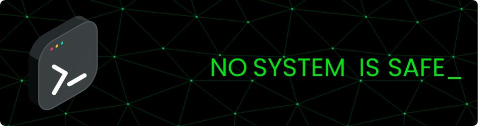

# 💫 About Me:
I'm a dedicated and curious **IT & Network Security enthusiast** 🛡️ with an interest in **Security Operation Center** and **network defense** 🌐. I focus on continuous learning, exploring new tools, and building practical skills through real-world challenges. ⚙️🚀 

# 💻 Tech Stack:
                            

# 📊 GitHub Stats:
 
 

## 🏆 GitHub Trophies

### ✍️ Random Dev Quote

---

<!-- Proudly created with GPRM ( https://gprm.itsvg.in ) -->
